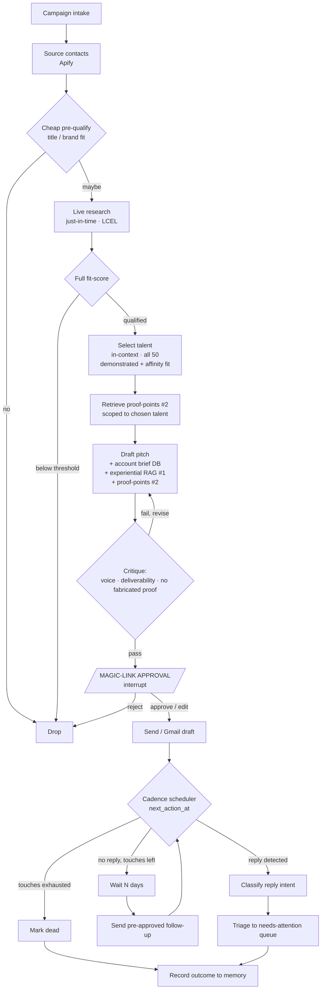

# Marquee

**An SDR-in-a-box for a solo talent-management agency.** Marquee sources brand-side
decision-makers, drafts personalized pitches introducing the agency's talent for events and
collaborations, and runs a human-approved multi-touch follow-up cadence that learns from real
outcomes, so a one-person agency can run outreach like a team.

> Productized, evaluated generalization of a bespoke outreach pipeline shipped for a real
> talent/PR agency client. Built to demonstrate applied LangChain / LangGraph / LangSmith.

**Status:** Phase 1 built and tested: the core graph (pre-qualify through send, Gmail dry-run)
with evals and CI. This README is the living architecture, refined as we go. See
[`PROJECT_SPEC.md`](./PROJECT_SPEC.md) for longer rationale.

---

## The problem

A solo talent agency pitches its roster (artists, creators, performers) to brand-side and PR
decision-makers (CMOs, brand managers, heads of partnerships) for events, collabs, and
sponsorships. The work is high-skill but low-leverage: manual sourcing, manual per-brand
research, hand-written pitches matching a specific talent to a specific brand moment, and
weeks of error-prone follow-up. No SDR team, no budget for Apollo or a Salesforce-class CRM,
non-technical, working solo.

Marquee automates the leverage while keeping the founder's judgment and voice in the loop, and
gets sharper every time a pitch lands.

---

## Who it's for & how they use it

One non-technical solo founder (single-tenant). **No install, no terminal.** The agent is a
hosted product; the LLM is invisible server-side infrastructure (the founder never picks or
pays for a model).

1. **Onboard:** describe the agency, add the roster + case studies, **paste 3-5 past pitches
   that landed** (seeds the learning memory so it's useful on day one), define target-brand
   criteria, connect Gmail (OAuth).
2. **Launch a campaign:** e.g. *"beauty brands doing experiential launches this quarter."*
3. **The agent works:** sources brand contacts, cheaply pre-qualifies, deep-researches the
   survivors, fit-scores talent against brand, drafts personalized pitches.
4. **Approve in one click:** the agent emails a daily digest; each draft has a research
   summary, fit score, and a **magic-link approve / edit / reject** button (deterministic, no
   app to learn, no risky reply-parsing). A web dashboard exists for setup and analytics.
5. **Send:** approved pitches send, or land as Gmail drafts.
6. **Follow-up engine (background):** sends pre-approved follow-ups on a schedule, detects
   and classifies replies, escalates real replies to a "needs attention" queue.
7. **Weekly digest + learning loop:** sent / replied / meetings booked; one tap to mark a
   conversion, which feeds the memory that improves future pitches.

---

## Architecture

### Three planes: execution, record, and memory

The boundary that separates a real deployment from a demo: graph execution state, the system
of record, and learned memory are **three different things** and must not be conflated.

```
┌──────────────────────────────────────────────────────────────────────┐
│ PLANE 1 - Graph execution state        (LangGraph checkpointer)        │
│ "What is this one pitch doing right now?"  One thread per opportunity.  │
│ Durable across the multi-week cadence, resumable at the approval gate.  │
│ Holds a small working set; references the DB by id.                     │
├──────────────────────────────────────────────────────────────────────┤
│ PLANE 2 - System of record             (SQLite -> Postgres)            │
│ Roster, leads, contacts, campaigns, pitches, messages, status, plus    │
│ ACCOUNT MEMORY: prior interactions per brand/contact (exact lookup).   │
│ Source of truth. Outlives any graph run. Powers dashboard + digest.    │
├──────────────────────────────────────────────────────────────────────┤
│ PLANE 3 - Vector memory                (Chroma -> managed)             │
│ (a) Experiential: past pitches + outcomes, similar-wins RAG (#1)       │
│ (b) Talent archives: a talent's body of work, proof-point RAG (#2)     │
│ Large + fuzzy corpora only. The learning moat that compounds over time.│
└──────────────────────────────────────────────────────────────────────┘
         │
         └── Projection: a Google Sheet the founder reads as a lightweight CRM
             (sync target of Plane 2, never the source of truth).
```

### How the drafter is grounded

Before writing, the agent assembles four grounding sources, each using the *right*
mechanism, not RAG-for-everything:

| Source | Question it answers | Mechanism |
|--------|--------------------|-----------|
| Talent selection | *Which* of the 50 talents fits this brand? | In-context ranking over compact bios (no RAG at 50) |
| Account memory | What do we know about *this* brand/contact? | Exact `brand_id` lookup + running account brief (Plane 2) |
| Experiential (#1) | What *past pitch* won in a *similar* situation? | Semantic RAG over past pitches + outcomes (Plane 3) |
| Proof-points (#2) | What of the chosen talent's *work* proves the fit? | Semantic RAG over that talent's archive (Plane 3) |

### Talent matching: select-then-prove

A two-stage match, ordered deliberately:

1. **Select (in-context, all 50).** Rank the roster against the brand's durable pillars on
   **two fit signals**: *demonstrated* fit (relevant past work) and *affinity* fit (stated
   interests, values, positioning, e.g. an eco-ambassador for a sustainability brand).
   Affinity matters because a talent can be the *best* fit on values alone, with no matching
   past project, so selection runs on the bio/profile, never on retrieval (which would drop
   a perfect-affinity talent whose archive returns zero hits).
2. **Prove (#2, scoped to the chosen talent).** *Then* retrieve that talent's specific work
   supporting the angle, to cite real evidence instead of adjectives.

**#2 is supplementary, with graceful degradation.** Proof-points returned give an evidence-backed
pitch (*"Léa's zero-waste set shows…"*). Empty gives an affinity pitch (*"Léa is an outspoken
sustainability advocate…"*). The pitch always works.

**Anti-hallucination guardrail:** the drafter may cite *only* proof-points actually retrieved,
never invented past work; when #2 is empty it must frame as affinity. The critique node
enforces this. (Claiming a talent did a campaign they didn't = a lie to a real prospect.)

### The learning loop (why #1's RAG compounds)

```
draft -> send -> capture outcome -> write to experiential memory -> sharpens the next draft
                 ├─ auto:   replied · reply-intent · bounced · ignored-after-N
                 └─ manual: one-tap "booked / meeting" in the weekly digest
```

Both RAG uses are justified by the same rule, **large corpus + fuzzy match**: experiential
memory grows unbounded and "similar situation" is inherently fuzzy; talent archives run to
hundreds of items and "relevant to this angle" is semantic. RAG is deliberately **not** used
for talent *selection* (50 bios fit in context) or account history (exact lookup). Brand
research is done **live, just-in-time**, never cached or indexed, since brand facts go stale.
Cold-start for #1 is solved by seeding the founder's own landed pitches at onboarding.

### The agent graph (LangGraph)

One thread **per opportunity** (per pitch). Each pitch is an independent, resumable state
machine, so many leads sit at different stages at once (one awaiting approval, one sleeping
until follow-up #2, one handling a reply), none blocking the others.



**Deliberate scoping decisions in the graph:**
- LangGraph only where state is real: the **critique loop** (a cycle), the **approval
  interrupt**, and the **multi-week cadence** (a durable state machine). Linear research is
  plain LCEL. Wrapping a chain in a graph framework is an anti-pattern.
- **Qualify before expensive research:** a cheap pre-filter drops obvious misses *before* the
  costly web-research step, instead of researching everyone and discarding later.
- **Follow-ups are pre-approved as a sequence**, so the founder isn't asked to approve
  200 emails (50 leads x 4 touches). Human attention is reserved for the first touch and for
  real replies, where judgment actually matters.
- **The cadence timer lives in Plane 2, not the graph.** A thread can't "sleep 5 days"
  holding resources; a worker scans `next_action_at` and resumes the checkpointed thread.

### Stack

| Layer | Choice |
|-------|--------|
| Language | Python |
| Orchestration | LangGraph (stateful core) + LangChain LCEL (linear sub-chains) |
| Observability & evals | LangSmith (tracing + eval harness) |
| LLM abstraction | LiteLLM wrapper in `services/` (backend LLM-agnostic) |
| API | FastAPI (thin) |
| Data validation | Pydantic throughout |
| System of record | SQLite (local) to Postgres (prod) via SQLModel |
| Experiential memory | Chroma (local) to managed vector store (prod) |
| Lead source | Apify (LinkedIn) behind a `services/` interface |
| Founder CRM view | Google Sheets |
| Email | Gmail API (OAuth) |
| Config | `pydantic-settings` |
| Tooling | `ruff`, `mypy` (strict), `pyproject.toml` + lockfile |

---

## Why these choices (the judgment calls)

The interesting part of this repo is *what was deliberately left out*:

- **LangGraph only where state is real:** loop, interrupt, cadence. Linear enrichment is LCEL.
- **RAG only where the corpus is large *and* the match is fuzzy:** experiential memory (#1)
  and talent proof-points (#2), yes; talent *selection* (50 bios) and account history (exact
  lookup), no. Proof-points are supplementary and degrade gracefully to affinity.
- **Right mechanism per grounding source:** in-context ranking for selection, exact lookup +
  running brief for account memory, semantic RAG for the two large/fuzzy corpora; never one
  hammer for every nail.
- **Live, just-in-time brand research:** never cached or indexed, because brand facts (new
  launches, events) go stale fast.
- **Single-tenant, by choice:** the product is one solo founder. No `agency_id` plumbing or
  fake multi-tenancy; a clean single-tenant deploy is honest about what's built.
- **Thread per opportunity:** independent, resumable per-pitch state machines, not one
  fragile mega-thread.
- **Magic-link approval, not reply-parsing:** deterministic actions for irreversible
  outbound; natural-language "approve 1, 3" parsing is a foot-gun when the cost of a misread
  is a wrong email to a real prospect.
- **Evals, not just a demo:** a LangSmith harness scores qualification accuracy against a
  labeled fit/no-fit set, pitch quality via an LLM judge (calibrated against human labels),
  and retrieval relevance; human approve/reject is logged back as a feedback signal.

---

## Production considerations & known limitations

Honest scope: the build is a deep, evaluated Phase 1. These are real-world concerns a
production deployment must handle, documented rather than hand-waved.

- **Deliverability.** Cold email from a personal Gmail lands in spam and harms domain
  reputation at volume. Production needs a dedicated sending domain, warmup, SPF/DKIM/DMARC,
  and respect for Gmail's sending limits. The demo runs in **Gmail dry-run** (writes drafts,
  never auto-sends), which sidesteps this for portfolio purposes.
- **Compliance (GDPR/CAN-SPAM).** An EU agency pitching EU brands needs a lawful basis,
  an unsubscribe mechanism, and a suppression list. Cold B2B outreach is regulated; this is a
  product/legal requirement, not an afterthought.
- **Reply detection is non-trivial.** Beyond thread matching (Message-ID / References), the
  system must distinguish real human replies from auto-responders, bounces (NDRs), and the
  founder's own sends, *then* classify intent. It is its own node cluster, not one edge.
- **Sourcing data quality.** We rely on **Apify** (LinkedIn), a deliberate cost tradeoff,
  since the target founders cannot afford Apollo (the reason this tool exists). Risks:
  LinkedIn ToS, scraper fragility, and coverage gaps. An **email-verification** step is
  needed before sending to protect deliverability.
- **Outcome attribution.** Off-platform conversions (a booking made on a call) can't be
  auto-detected; the learning loop combines auto signals (reply/bounce/ignore) with one-tap
  manual labels in the digest.
- **Secret management.** Gmail OAuth refresh tokens are long-lived secrets; production needs
  encrypted-at-rest storage / a KMS. The local build keeps them in env/local only.
- **Cost & caching.** A 50-lead campaign with a critique loop is hundreds of LLM calls. The
  static prefix (brand-voice system prompt + few-shot block) should use prompt caching, and
  campaigns should carry a per-run budget guardrail.
- **Negotiation is out of scope, by design.** The reply node triages and escalates at *"they're
  interested"*, and does not negotiate rates, exclusivity, or terms. A downstream deal-desk /
  objection-handling agent (with its own contract/rate knowledge base, e.g. a CUAD-style legal
  agent) can attach at the reply node, consuming the same account memory. Kept separate to
  avoid bolting a high-stakes commercial-legal surface onto the outreach core.

---

## Planned repo structure

```
marquee/
├── agents/              # graph assembly: agents/outreach_graph.py
│   └── nodes/           # one file per node (source, prequalify, research, qualify, draft, critique, ...)
├── services/            # LLM (LiteLLM), Gmail, Apify lead source, DB repos, fit-scoring, reply-classify
├── models/              # Pydantic: domain entities + LangGraph state
├── memory/              # experiential memory (past-pitch vector store) + retrieval policy
├── prompts/             # versioned prompt templates + prompts/utils.py
├── config/              # pydantic-settings
├── tools/               # thin LangChain tool wrappers
├── api/                 # FastAPI routes (thin)
├── evals/               # eval datasets + harnesses (separate from tests)
├── tests/               # unit / integration / system (incl. interrupt + fake-clock cadence tests)
├── .env.example
├── CLAUDE.md
└── README.md
```

---

## Deployment

- **Portfolio-grade (build first):** runs locally with `langgraph dev` + recorded lead data +
  Gmail dry-run. Reproducible end-to-end, evals included, no paid API keys required to run
  the core graph.
- **Production path (documented):** the graph on LangGraph Platform (managed API +
  persistence + a worker for the cadence), thin FastAPI, minimal Next.js review-queue UI,
  Gmail OAuth, Apify sourcing behind the `services/` interface, plus the production
  considerations above.

---

## Roadmap

- **Phase 1 (depth-first build):** intake, pre-qualify, live research, qualify,
  select-then-prove (talent selection + #2 proof-points), draft (account brief + seeded
  experiential RAG #1 + proof-points #2), critique loop, approval interrupt, Gmail
  dry-run. Reply detection + triage. LangSmith tracing + qualification, pitch-quality, and
  retrieval evals. (Approval via the `langgraph dev` interrupt; the magic-link UI is Phase 3.)
- **Phase 2:** full follow-up cadence with durable scheduler; the outcome-to-memory learning
  loop closing on real data.
- **Phase 3:** thin FastAPI + minimal review-queue UI; Sheets CRM projection.
- **Phase 4:** production deploy on LangGraph Platform + Gmail OAuth + live Apify sourcing +
  deliverability/compliance layer.
